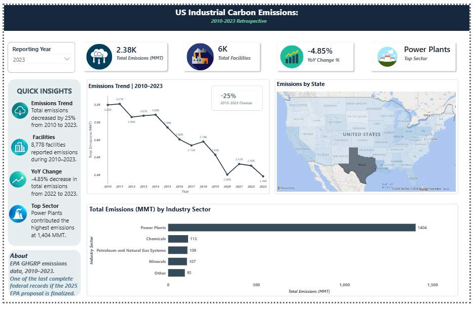

# epa-emissions-retrospective
US Industrial Carbon Emissions Analysis (2010-2023) — EPA GHGRP final dataset
# US Industrial Carbon Emissions Retrospective Dashboard

<p align="center">
  
</p>

<p align="center">
  <b>Excel • Python • Pandas • NumPy • SQL • SQLite • Matplotlib • Power BI • DAX</b>
</p>

<p align="center">
  <a href="#overview">Overview</a> •
  <a href="#key-insights">Key Insights</a> •
  <a href="#tech-stack">Tech Stack</a> •
  <a href="#methodology">Methodology</a> •
  <a href="#power-bi-dashboard">Power BI Dashboard</a> •
  <a href="#repository-structure">Repository</a>
</p>

---

## Overview

In September 2025, the EPA proposed eliminating mandatory greenhouse gas reporting for 46 of the 47 industrial source categories under the GHGRP. The rule hasn't been finalized as of this writing — but if it is, the 2010–2023 dataset becomes one of the last complete federal records of U.S. industrial emissions before the reporting requirement disappears.

I built this project to analyze that dataset end-to-end — from raw EPA Excel files to an interactive Power BI dashboard.

**The workflow:** Excel inspection → Python cleaning → SQL analysis → Matplotlib charts → Power BI dashboard

---

## Project Metrics

| Metric | Value |
|---|---:|
| Records analyzed | 94,378 facility-year rows |
| Time period | 2010–2023 (14 years) |
| Unique facilities | 8,778 |
| Geographic coverage | 54 states/territories |
| Rows removed during cleaning | 0 |
| Missing `total_emissions` | 0 |
| Missing NAICS codes | 9 |
| Zero-reported records (flagged, not deleted) | 498 |
| National emissions change, 2010→2023 | ~25% decline |
| YoY change, 2022→2023 | -4.85% |

*All figures calculated from this project's cleaned analytical dataset — not an official EPA figure.*

---

## Key Insights

**Emissions are down ~25% since 2010.** Reported industrial emissions in the analytical dataset fell from their 2010 baseline to 2023, with a -4.85% year-over-year drop in the most recent period.

**Power plants dominate.** They're the single largest emitting sector in 2023, at roughly 1,404 MMT — about 59% of everything in the analysis. Everything else is a distant second.

**Emissions are geographically concentrated.** Texas, Louisiana, and Wyoming are consistently the highest-emitting states, which narrows where monitoring and reduction efforts would have the biggest impact.

**Data quality needed a decision, not a shortcut.** 498 records reported zero emissions. Rather than dropping them (which would quietly shrink the population) or treating them as missing data, I added an `emissions_flag` column and kept them in the dataset:

| Flag | Count | Meaning |
|---|---:|---|
| `VALID` | 93,880 | Reported emissions > 0 |
| `ZERO_REPORTED` | 498 | Reported, but zero |

---

## Business Questions

1. How have reported industrial emissions changed from 2010 to 2023?
2. Which sectors contribute the most emissions?
3. Which states have the highest reported emissions?
4. Which individual facilities are the largest emitters?
5. How has the number of reporting facilities changed over time?
6. What are the year-over-year changes across major sectors?
7. How concentrated are emissions across sectors and locations?
8. What data-quality caveats should someone using this data know about?

---

## Tech Stack

| Layer | Technology | Purpose |
|---|---|---|
| Spreadsheet analysis | Microsoft Excel | Initial inspection, filtering, validation |
| Data engineering | Python | Ingestion, cleaning, transformation |
| Data analysis | Pandas, NumPy | Manipulation and numerical analysis |
| Database | SQLite | Analytical storage |
| Analytics | SQL (CTEs, `LAG()` window functions) | Aggregation, ranking, YoY trend analysis |
| Visualization | Matplotlib | Static analytical charts |
| BI | Power BI + DAX | Interactive dashboard, KPIs, time intelligence |
| Version control | Git, GitHub | Project versioning |

---

## Methodology

### 1. Excel Inspection
Before writing any code, I reviewed the annual EPA GHGRP files directly in Excel — checking column structures, header inconsistencies, missing values, and differences between yearly file formats. This shaped how the Python pipeline needed to handle each year.

### 2. Python Pipeline
Combines the 14 annual files into one standardized dataset: loads each year, fixes metadata/header rows, standardizes column names to `snake_case`, selects the core analytical fields, merges years, handles missing address/county values, converts data types, and validates the result.

**Core fields kept:** `facility_id`, `facility_name`, `city`, `state`, `zip_code`, `address`, `county`, `latitude`, `longitude`, `naics_code`, `industry_sector`, `total_emissions`, `reporting_year`, plus the derived `emissions_flag`.

**Result:** 94,378 rows × 14 columns, 2010–2023, 8,778 facilities, 54 states/territories, zero rows dropped.

### 3. SQLite + SQL Analysis
Loaded the cleaned data into SQLite and wrote five analytical queries:

| Query | Techniques | Purpose |
|---|---|---|
| National emissions trend | `GROUP BY`, `SUM`, `COUNT(DISTINCT)` | 14-year trajectory |
| Top 10 sectors | `WHERE`, `GROUP BY`, `ORDER BY`, `LIMIT` | Major emitting sectors |
| Top 20 facilities | `ORDER BY`, `LIMIT` | Highest individual emitters |
| State rankings | `GROUP BY`, aggregation | Geographic comparison |
| YoY sector analysis | CTE + `LAG()` | Year-over-year change by sector |

### 4. Visualization
Five Matplotlib charts (national trend, top sectors, top states, facility count over time, emissions vs. facility count) — these became the analytical basis for the dashboard.

---

## Power BI Dashboard

- **KPI cards:** total emissions, facility count, YoY change, top sector
- **Trend line:** 2010–2023 emissions trajectory
- **Filled map:** emissions by state
- **Sector comparison:** largest emitting industries
- **Key insights panel**
- **Year slicer** for filtering while keeping trend context

DAX measures cover total emissions, total facilities, YoY change %, and change-since-2010 %, plus sector-level breakdowns.

---

## Repository Structure

```text
epa-emissions-retrospective/
│
├── notebooks/
│   └── 01_data_pipeline.ipynb
│
├── sql/
│   └── analysis_queries.sql
│
├── charts/
│   ├── 01_national_trend.png
│   ├── 02_top_sectors.png
│   ├── 03_top_states.png
│   ├── 04_facility_count.png
│   └── 05_emissions_vs_facilities.png
│
├── docs/
│   └── dashboard_page1.png
│
├── powerbi/
│   └── EPA_Emissions_Dashboard.pbix
│
├── requirements.txt
├── .gitignore
└── README.md
```

---

## How to Run

**Prerequisites:** Python 3.x, Microsoft Excel, Jupyter Notebook (or Colab), Power BI Desktop

```bash
pip install -r requirements.txt
```

1. Download the EPA GHGRP datasets for 2010–2023.
2. Inspect the annual files in Excel to understand structure and quirks.
3. Run `notebooks/01_data_pipeline.ipynb` (update the data path if needed).
4. Review the cleaned dataset it produces.
5. Run the queries in `sql/analysis_queries.sql` against the SQLite database.
6. Check the generated charts in `charts/`.
7. Open `powerbi/EPA_Emissions_Dashboard.pbix` in Power BI Desktop.

---

## Data Source

U.S. EPA Greenhouse Gas Reporting Program (GHGRP): https://www.epa.gov/ghgreporting/data-sets

## Disclaimer

This is an independent portfolio project built on publicly available EPA GHGRP data. Metrics and conclusions reflect this project's own field selection, cleaning rules, and methodology — they are not an official EPA analysis and shouldn't be treated as a substitute for EPA's official U.S. Greenhouse Gas Inventory.

---

## Author

**Puja Kumari**
Computer Science | Data Analytics | Python | SQL | Excel | Power BI

*Last updated: August 2026*
